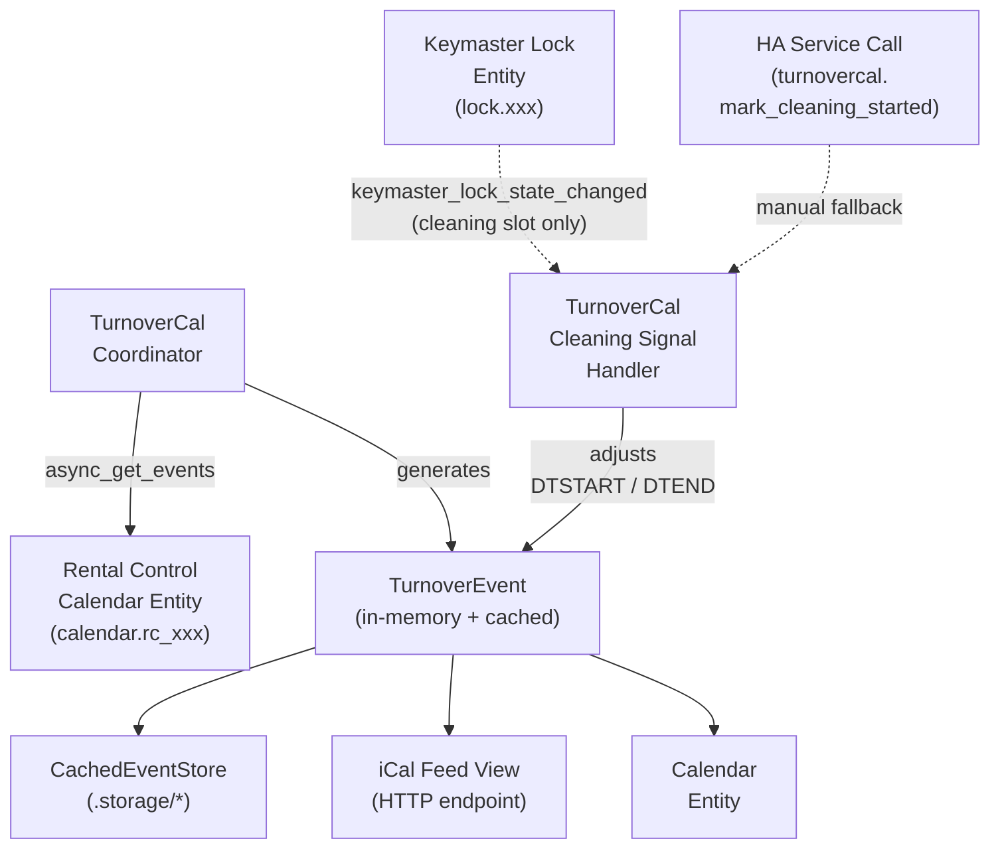

<!--
SPDX-FileCopyrightText: 2026 Andrew Grimberg <tykeal@bardicgrove.org>
SPDX-License-Identifier: Apache-2.0
-->

# Data Model: TurnoverCal iCal Export

**Feature**: 001-ical-turnover-export
**Date**: 2026-03-16
**Status**: Complete

## Entities

### TurnoverEvent

Represents a cleaning window between two consecutive guest stays.

<!-- markdownlint-disable MD013 -->

| Field | Type | Description | Constraints |
| --- | --- | --- | --- |
| uid | `str` | Deterministic event identifier | Truncated SHA-256 hex digest of source event IDs (first 16 chars); format `{hex16}@turnovercal.homeassistant`; immutable across recalculations |
| summary | `str` | Event title for iCal feed | Must not contain guest PII (FR-014); format: `"{prefix} - {property_name}"` |
| dtstart | `datetime` | Turnover window start (guest checkout) | Timezone-aware; sourced from departing guest event `end` |
| dtend | `datetime` | Turnover window end (next guest check-in) | Timezone-aware; sourced from arriving guest event `start`; may be adjusted by lock event |
| timezone | `str` | IANA timezone identifier | From HA configured local timezone; used for VTIMEZONE generation |
| source_checkout_id | `str` | Identifier of the departing guest event | Used for UID generation and event correlation |
| source_checkin_id | `str \| None` | Identifier of the arriving guest event | `None` for trailing turnover events; used for UID generation and event correlation |
| created_at | `datetime` | When this turnover event was first generated | UTC; used for retention period calculation |
| status | `str` | Event lifecycle state | One of: `scheduled`, `adjusted`, `completed` |
| is_trailing | `bool` | Whether this is a trailing turnover (no next guest) | Default: `False`; trailing events use configured duration for DTEND |
| adjusted_by_lock | `bool` | Whether DTEND was shortened by a lock or manual event | Default: `False`; set by Keymaster event or service call |
| lock_unlock_time | `datetime \| None` | When cleaning started (unlock or service call) | UTC; `None` if no adjustment |
| adjustment_source | `str \| None` | What triggered the adjustment | One of: `"keymaster"`, `"service_call"`, `None` |
| original_dtend | `datetime \| None` | Original end time before adjustment | Preserved for audit; `None` if never adjusted |
| original_dtstart | `datetime \| None` | Original start time before early-unlock adjustment | Preserved for audit; `None` if never adjusted |

<!-- markdownlint-enable MD013 -->

**Validation rules**:

- `dtstart` < `dtend` (no negative-duration events; FR-012)
- If `dtstart` == `dtend`, set `dtend` = `dtstart` + 1 minute
  (FR-011)
- `uid` must be stable: same source events always produce same UID
  (FR-010)
- For trailing events (`is_trailing=True`), UID is derived from the
  checkout event ID alone plus a trailing sentinel value
- When a new guest event appears after a trailing turnover, the
  trailing event is replaced (deleted) and a standard event is
  created with a new UID derived from both source events
- `summary` must not contain guest names, phone numbers, or booking
  references

**State transitions**:

<!-- markdownlint-disable MD013 -->

```mermaid
    [*] --> scheduled
    scheduled --> adjusted : lock unlock or service call\n(during window or grace period)
    scheduled --> completed : past DTEND
    adjusted --> completed : past DTEND
    adjusted --> scheduled : source event modified\n(recalculate)
    completed --> scheduled : source event modified\n(recalculate)
```

<!-- markdownlint-enable MD013 -->

### CachedEventStore

Persistent storage wrapper for turnover events.

| Field | Type | Description | Constraints |
| --- | --- | --- | --- |
| version | `int` | Storage schema version | Currently `1`; used for migration |
| events | `dict[str, TurnoverEvent]` | UID → event map | O(1) lookup by UID |
| last_cleanup | `datetime` | Last expiry cleanup timestamp | UTC |
| feed_token | `str` | Secret iCal URL token | Via `secrets.token_urlsafe(32)` |

**Retention rules**:

- Events with `created_at` older than the configured retention period
  (default: 6 weeks) are removed during cleanup
- Cleanup runs hourly via `async_track_time_interval()`
- Events are never removed while their turnover window is in the
  future, regardless of retention period

### ConfigEntryData

Data captured during the config flow setup step.

<!-- markdownlint-disable MD013 -->

| Field | Type | Description | Constraints |
| --- | --- | --- | --- |
| calendar_entity_id | `str` | Rental Control calendar entity | Must be a valid `calendar.*` entity |
| has_keymaster | `bool` | Whether Keymaster lock is associated | Auto-detected from Rental Control config |
| lock_entity_id | `str \| None` | Keymaster lock entity | Required if `has_keymaster` is `True` |
| cleaning_code_slot | `int \| None` | Keymaster code slot for cleaning staff | Required if `has_keymaster` is `True`; the dedicated permanent slot used by cleaners |
| feed_token | `str` | Secret URL token | Generated at setup; stored encrypted |

<!-- markdownlint-enable MD013 -->

### ConfigEntryOptions

User-adjustable settings via the options flow.

<!-- markdownlint-disable MD013 -->

| Field | Type | Description | Constraints |
| --- | --- | --- | --- |
| retention_weeks | `int` | How long to keep past events | Default: 6; range: 1–52 |
| summary_prefix | `str` | Prefix for turnover event summaries | Default: `"Turnover"` |
| lock_monitoring | `bool` | Enable Keymaster lock monitoring | Default: `True` if lock available |
| cleaning_code_slot | `int \| None` | Keymaster code slot for cleaning staff | Changeable via options; must match the permanent slot assigned to cleaners in Keymaster |
| trailing_duration_hours | `int` | Duration (hours) for trailing turnover events | Default: 4; range: 1–24 (FR-016) |
| early_unlock_grace_hours | `int` | Grace period (hours) before checkout for early unlock | Default: 2; range: 0–12; 0 disables (FR-018) |
| update_interval | `int` | Minutes between calendar polls | Default: 5; range: 1–60 |

<!-- markdownlint-enable MD013 -->

## Relationships



**Cardinality**:

- 1 TurnoverCal config entry → 1 Rental Control calendar entity
- 1 Rental Control calendar → 0..N TurnoverEvents (one per
  consecutive guest pair)
- 1 TurnoverCal config entry → 0..1 Keymaster lock entity
- 1 TurnoverEvent → exactly 2 source guest events (checkout +
  check-in), or 1 source guest event for trailing turnovers
- 1 CachedEventStore → 0..N TurnoverEvents

## Serialization Format (Store JSON)

All `dtstart`, `dtend`, `original_dtstart`, and `original_dtend`
values are stored as **naive local time** ISO 8601 strings (no
offset, no `Z` suffix). The companion `timezone` field (IANA zone
name) provides the interpretation context. This mirrors how Rental
Control stores event times and avoids DST-ambiguity issues that
arise from storing offsets. UTC timestamps (`created_at`,
`last_cleanup`, `lock_unlock_time`) include an explicit offset.

```json
{
  "version": 1,
  "feed_token": "URL-SAFE-BASE64-TOKEN-43-CHARS",
  "events": {
    "a1b2c3d4e5f60718@turnovercal.homeassistant": {
      "uid": "a1b2c3d4e5f60718@turnovercal.homeassistant",
      "summary": "Turnover - Beach House",
      "dtstart": "2026-03-10T11:00:00",
      "dtend": "2026-03-10T15:00:00",
      "timezone": "America/New_York",
      "source_checkout_id": "rc-event-001",
      "source_checkin_id": "rc-event-002",
      "created_at": "2026-03-01T12:00:00+00:00",
      "status": "scheduled",
      "is_trailing": false,
      "adjusted_by_lock": false,
      "lock_unlock_time": null,
      "adjustment_source": null,
      "original_dtend": null,
      "original_dtstart": null
    }
  },
  "last_cleanup": "2026-03-16T00:00:00+00:00"
}
```
